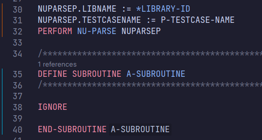

# VSCode Natural Language Client

[](https://marketplace.visualstudio.com/items?itemName=markusamshove.vscode-natural)

Language Client implementation for [Natural Language Server (natls)](https://github.com/markusamshove/natls).

To see features that currently work, have a look over at the [natls documentation](https://github.com/MarkusAmshove/natls/blob/main/docs/lsp-features.md).

## Prerequisites

The Language Server needs to find a file called `.natural` within the Natural project folder which configures the libraries and step lib relationships.

The expected structure looks like this:

```
ProjectDir
|- .natural
|- Natural-Libraries/
```

NaturalONE generates a `.natural` file if you press `Store new defaults` within the properties of a project.

All thats needed from the `.natural` file are the `<LibrarySteplib>` entries, e.g.:

```
<LibrarySteplib>
	<LibrarySteplibName>LIBONE</LibrarySteplibName>
	<LibrarySteplibNSV>LIBONE</LibrarySteplibNSV>
	<LibrarySteplibExtensions>0;</LibrarySteplibExtensions>
</LibrarySteplib>
<LibrarySteplib>
	<LibrarySteplibName>LIBTWO</LibrarySteplibName>
	<LibrarySteplibNSV>LIBONE</LibrarySteplibNSV>
	<LibrarySteplibExtensions>1;LIBTWO[-1,-1];</LibrarySteplibExtensions>
</LibrarySteplib>
```

## Versioning

Although this extension does have three numerics in its version number, it doesn't use semantic versioning.

The first two digits (e.g. `0.2`) belong to the natls version it is bundled with. The last digit is used for any
bugfix or enhancement that was done during the period of that natls version.

## Settings

The [Language Server Configuration](https://github.com/MarkusAmshove/natls/blob/main/docs/lsp-config.md) can be configured with the same keys they're specified in in the linked documentation.
E.g. setting `"natls.completion.qualify": true,` in your VSCode `settings.json` results in the Language Server always completing variables fully qualified where applicable.

## Additional features

### Nesting level gutters



The editor will show a gutter line for the main body (orange) and subroutine bodies (teal) to indicate if a statement is within a subroutine or the main code.

This is helpful, because you can write statements in the main body of a module after defining subroutines.

This can be disabled with `"natls.gutter.body": false`.

The config `natls.gutter.topLevelOnly` (default `true`) configures if only the top level statements should have a gutter.
To resemble the configuration of the screenshot, this has to be set to `false`.
